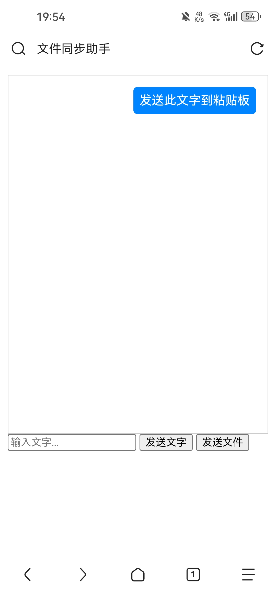
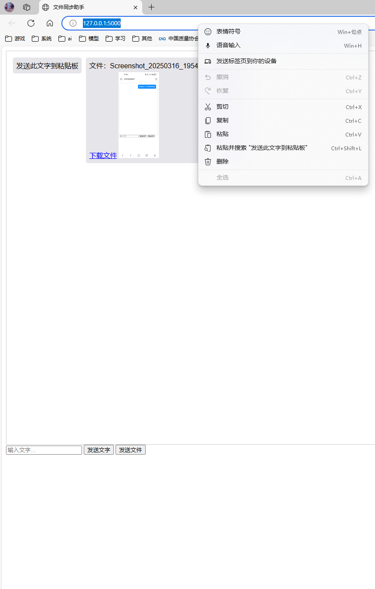

# 此软件完全由deepseek完成，本人只做发布，原本只想方便手机上复制的文字发送到电脑上使用，又不想在电脑上安装微信之类的软件，遂用deepseek实现，之后又加了传输文件和预览功能，传输的文件在uploads目录里（传输后自动生成），注意仅限局域网使用。

# Sync-assistant 🚀

局域网跨设备剪贴板同步工具，支持手机发送文字到电脑粘贴板与文件相互传输。

## 功能特性
- 📋 文字双向同步（自动复制到剪贴板）
- 📁 文件传输
- 🖼️ 图片/视频/音频预览

## 快速开始
1. 安装依赖：
   ```bash
   pip install -r requirements.txt
   ```
2. 运行服务：
   ```bash
   python 文件同步助手.py
   ```
3. 访问 `http://[你的IP]:5000`，参考运行py后命令行出现的地址

## 截图



## 开源协议
MIT License
